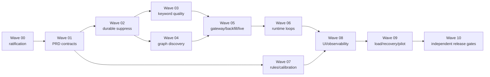

---
name: Telegram Lead Discovery — remediation and production-readiness
overview: >
  Исполнимый план исправления повторяющегося и низкокачественного source discovery,
  запуска полного monitoring pipeline и доказательства ёмкости 100 публичных источников
  / не менее 1000 сообщений в сутки без AI, auto-outreach и private auto-join.
status: Одобрен
audit_date: 2026-07-27
dispatch_override: owner-2026-07-27
dispatch_override_path: .omc/artifacts/lead-discovery-remediation/EXECUTION_DISPATCH_OVERRIDE.md
isProject: false
todos:
  - id: wave-00
    content: "Зафиксировать baseline, сохранить пользовательский dirty worktree и провести Planner → Architect → Critic ratification"
    status: completed
  - id: wave-01
    content: "Синхронизировать PRD, decision log, shared contracts и TRACEABILITY до изменения product code"
    status: completed
  - id: wave-02
    content: "Завершить durable dismiss/suppress, исторический backfill, canonical identity и миграцию 003"
    status: completed
  - id: wave-03
    content: "Исправить keyword discovery: novelty, replacement acquisition, profile semantics и quality eligibility"
    status: completed
  - id: wave-04
    content: "Реализовать bounded graph discovery публичных источников с provenance и suppress"
    status: completed
  - id: wave-05
    content: "Довести TelegramGateway, backfill и live updates до production contract"
    status: completed
  - id: wave-06
    content: "Запустить collector, processing, notification и reconciliation workers в едином runtime"
    status: completed
  - id: wave-07
    content: "Подключить version-pinned detection rules и воспроизводимую calibration"
    status: completed
  - id: wave-08
    content: "Доработать RU-first UI, lifecycle, health и продуктовые метрики"
    status: completed
  - id: wave-09
    content: "Доказать recovery, нагрузочную ёмкость 100 sources / 1000 messages/day и Windows pilot"
    status: pending
  - id: wave-10
    content: "Провести независимые code/security/release reviews и deep merge-readiness"
    status: pending
---

# План реализации исправлений Telegram Lead Discovery

> **Статус:** `Одобрен`. Исполнение волн разрешено владельцем.
> Live SQLite, Telegram session, внешние Telegram-чаты и Bot API остаются
> fail-closed по HC-6 и gate Wave 09.
>
> **Dispatch override (owner 2026-07-27):** см.
> `.omc/artifacts/lead-discovery-remediation/EXECUTION_DISPATCH_OVERRIDE.md`.
> Паттерн: `wave → executor (tests+code) → verifier`; architect/critic только
> Wave 00 и при смене контракта/ADR; security только 04/05/10; Wave 10 =
> code-reviewer + security + verifier; координатор может писать простые волны.
> Цели/AC волн и fail-closed gates плана не ослабляются.

## 0. Как главный LLM-агент обязан использовать этот документ

Этот документ является orchestration contract. Главный агент не может заменить
назначение субагентов собственным выполнением и не может объявить волну завершённой по
самоотчёту её автора.

Порядок исполнения:

1. Прочитать этот файл целиком.
2. Пройти обязательный preflight из
   `.cursor/skills/agent-preflight/SKILL.md`.
3. Проверить `git status --short` и зафиксировать существующие пользовательские изменения.
4. Выполнять волны строго по зависимостям из раздела 8.
5. Для каждой волны назначить перечисленных субагентов с указанными skills и ownership.
6. Не запускать двух write-agents одновременно, если их file ownership пересекается.
7. После каждого write-agent запускать отдельного read-only verifier.
8. При `FAIL`, `INCOMPLETE`, `REVISE` или отсутствии evidence вернуть работу автору;
   следующую волну не начинать.
9. В конце каждой волны обновить только её evidence manifest и статус plan todo.
10. После Wave 10 остановиться перед commit/push/merge и запросить решение владельца.

Одна волна должна выполняться как одна управляемая сессия. Если контекст переполнен,
главный агент обязан сохранить evidence, остановиться на gate и продолжить новой сессией
с повторным чтением этого плана.

---

## 1. HARD CONDITIONS

### HC-0 — главный агент является только координатором

Главный агент:

- назначает субагентов;
- разрешает зависимости и конфликты ownership;
- читает их отчёты и свежие evidence;
- ведёт `.omc/artifacts/lead-discovery-remediation/`;
- меняет статусы этого плана;
- останавливает pipeline при нарушении gate.

Главный агент **не пишет** product code, миграции, тесты или product PRD. Исключение —
механическое обновление статуса этого плана и evidence index после независимой проверки.

### HC-1 — обязательное чтение для каждого субагента

До первого `Read/Grep/Shell/Edit/Task` каждый субагент обязан:

1. Вызвать MCP `sequential-thinking/sequentialthinking`:
   - 2–3 thoughts для любой волны этого плана;
   - указать scope, риск и tool/skill inventory.
2. Прочитать полностью:
   - корневой `AGENTS.md`;
   - этот план;
   - `.cursor/skills/agent-preflight/SKILL.md`;
   - назначенные ему skills из dispatch;
   - `AGENTS.md` и `PRD.md` primary-модуля;
   - непосредственные upstream/downstream PRD;
   - `docs/prd/TRACEABILITY.md` перед завершением записи.
3. Напечатать preflight block:

```markdown
### Pre-flight
- Mode: Agent
- Complex: yes
- Reason: <почему назначение нетривиально>
- Sequential-thinking: done
- Subagents: none — leaf-agent не делегирует без разрешения координатора
- MCPs: sequential-thinking/sequentialthinking — scope, risks, inventory
- Skills: <точные пути из dispatch>
- Ownership: <разрешённые пути>
- Forbidden writes: <всё вне ownership>
- First action after preflight: <конкретная проверка>
```

Если preflight отсутствует или skill не прочитан, координатор отклоняет результат без
рассмотрения кода.

### HC-2 — разрешённые repository-local skills

Не выдумывать имена skills и не использовать quarantined LeadGenerator skills.

| Skill | Кому обязателен | Назначение |
|---|---|---|
| `.cursor/skills/agent-preflight/SKILL.md` | всем агентам | обязательный inventory и MCP preflight |
| `.cursor/skills/plan/SKILL.md` | `planner`, `architect`, `critic`, координатор Wave 00 | planning boundary, testable criteria, risk/rollback |
| `.cursor/skills/verify/SKILL.md` | `test-engineer`, `verifier`, `qa-tester`, `writer` | только свежие проверяемые claims |
| `.cursor/skills/merge-readiness/SKILL.md` | координатор после Wave 10 | deep human-understanding gate; не заменяет review/tests |

`cloudflare-api` и `cloudflare-docs` из `.cursor/mcp.json` для этой задачи не нужны и
не должны вызываться.

### HC-3 — обязательный dispatch prompt

Координатор обязан передать каждому субагенту все поля:

```text
Role: <точный .cursor/agents/*.md>
Wave: <ID и название>
Goal: <один наблюдаемый результат>
Read first: AGENTS.md, полный plan path, assigned skill paths, module PRDs
Mandatory MCP: sequential-thinking/sequentialthinking, 2–3 thoughts
File ownership: <точные файлы/каталоги>
Forbidden writes: everything else; never revert existing user changes
Inputs: <артефакты предыдущих волн>
Acceptance criteria: <из соответствующей волны>
Required commands: <точные команды>
Deliverable: <код/документ/evidence report>
Return schema: Status, Files changed, Commands, AC mapping, Risks, Remaining gaps
Stop conditions: <fail-closed условия>
```

Субагент не имеет права расширять ownership. При необходимости нового файла он сначала
возвращает `BLOCKED` с обоснованием; координатор явно меняет dispatch.

### HC-4 — автор не верифицирует собственную работу

- `executor`, `writer` и `test-engineer` могут запускать свои проверки, но это не gate.
- Gate выполняет новый `verifier` с read-only ownership.
- `verifier` запускает команды заново из текущего состояния worktree.
- Локальные evidence claims, проверенные
  `node tools/quality/verify-local-claim.mjs`, сильнее текстового `### Compliance`.
- Любой skipped test имеет owner, причину и срок устранения; иначе gate = `INCOMPLETE`.

### HC-5 — защита пользовательского dirty worktree

На 2026-07-27 в worktree уже присутствуют незавершённые изменения D-059/D-060 и
неотслеживаемая миграция `003_dismissed_keyword_suppress.py`.

Обязательно:

- сохранить `git status --short`, `git diff --stat`, `git diff --name-only` в baseline;
- не удалять, не reset/revert и не переформатировать несвязанные изменения;
- до редактирования каждого пересекающегося файла снять его diff;
- не коммитить `__pycache__`, `.pyc`, live DB, Telegram session, logs или secrets;
- при непонятном происхождении изменения остановиться и запросить владельца.

### HC-6 — live-системы и секреты fail-closed

- Unit/integration/load tests используют fake gateway и изолированную temp SQLite.
- Реальные `TG_API_ID`, `TG_API_HASH`, `TG_BOT_TOKEN`, session-файлы и chat IDs не
  выводятся в prompt, logs или evidence.
- До Wave 09 запрещены реальные Telegram joins, Bot API sends и изменение live DB.
- В Wave 09 live smoke допускается только после явного operator approval, backup,
  integrity check и остановки старого runtime.
- Только публичные источники, уже одобренные оператором, могут попасть в monitoring.
- Никакого AI/LLM, auto-outreach, private auto-join, paid search или Stars.

### HC-7 — PRD-first и один владелец контракта

Если реализация требует нового поля, enum, job, event, threshold или state:

1. Сначала меняется owner PRD и `DECISION_LOG.md`.
2. Затем shared contract.
3. Затем непосредственные consumers.
4. Затем `TRACEABILITY.md`.
5. Только после `validate-prd.py = pass` разрешён product code.

Запрещено маскировать semantic gap тем, что structural PRD validator зелёный.

### HC-8 — каждая волна атомарна

До входа в следующую волну должны существовать:

- implementation report автора;
- independent verification report;
- список команд с exit code;
- acceptance-criteria matrix;
- diff scope check;
- rollback note;
- evidence manifest с SHA-256 изменённых файлов.

---

## 2. Цель, scope и измеримый итог

### Цель

Получить локальный RU-first инструмент, который:

- не возвращает dismissed/rejected source в последующих discovery runs;
- не зацикливается на одном и том же небольшом наборе directory results;
- отделяет слабые источники от пригодных для ручной оценки;
- реально собирает backfill и live messages только из `monitoring` sources;
- детерминированно и воспроизводимо создаёт лиды по version-pinned rules;
- выдерживает 100 monitoring sources и не менее 1000 сообщений/сутки;
- не выполняет автоматический outreach и не использует AI в runtime.

### В scope

- source identity, durable suppress, novelty/cooldown, replacement acquisition;
- keyword discovery и bounded graph discovery публичных источников;
- opportunity scoring и source-quality evidence;
- Telethon gateway, backfill, live updates, checkpoints и reconciliation;
- processing, revisions, exact dedupe, detection, scoring, outbox;
- runtime lifecycle, health, jobs, logs, backup/restore;
- RU-first UI для source lifecycle, discovery и inbox;
- deterministic calibration corpus и capacity/recovery tests.

### Вне scope

- AI/semantic ranking или LLM в product runtime;
- private auto-join;
- Telegram Stars/paid search;
- multi-user/RBAC;
- автоматический outreach;
- обход Telegram rate limits;
- обещание, что внешние чаты физически создадут 1000 сообщений в конкретный день.
  Проверяется ёмкость ingestion pipeline; фактический внешний volume отображается отдельно.

### Product success gates

| Область | Обязательный результат |
|---|---|
| Permanent suppress | `0` повторных показов canonical dismissed identity во всех будущих runs, включая historical dismiss до миграции |
| Run dedupe | Один canonical source появляется не более одного раза в одном run независимо от username/ID/alias |
| Replacement | После suppress worker продолжает acquisition до run quota или фиксирует `pool_exhausted` с причиной |
| Novelty | На deterministic fixture с достаточным replacement pool ≥80% показанных результатов после первого run новые; dismissed recurrence = 0 |
| Live discovery pilot | 5 последовательных runs: dismissed recurrence = 0; median pairwise Jaccard ≤0.60 либо каждый нарушающий run имеет доказанный `pool_exhausted` |
| Quality default | `weak` не показывается в основном candidate queue; доступен только явным фильтром |
| Evidence | Directory-only source без message/member/activity evidence не получает `moderate/strong` и не auto-promote |
| Monitoring capacity | 100 `monitoring` sources; replay ≥1000 messages/day без потерь и duplicate raw messages |
| Burst | 10 messages/s в течение 10 минут (6000 events), backlog полностью обработан ≤15 минут после окончания burst |
| Correctness | exact dedupe = 100%; restart/replay не создаёт второй raw message/lead/outbox item |
| Latency | p95 `received_at → processed_at` ≤30 s при steady 1000/day; p95 ≤120 s во время burst |
| Recovery | После kill/restart reconciliation восстанавливает незавершённые jobs и продолжает с checkpoint без gap |
| Detection calibration | locked corpus ≥500 сообщений из ≥10 типов источников; hot precision ≥0.80, hot+warm precision ≥0.70, purchase-intent recall ≥0.75 |
| Security | UI bind только `127.0.0.1`; секреты/session/PII не попадают в logs/evidence |

---

## 3. Current-state evidence, которое будущий агент обязан перепроверить

Это baseline аудита, а не вечная истина. Wave 00 должна подтвердить или обновить каждое
утверждение с `path:line` и свежими read-only запросами.

| Finding | Evidence на 2026-07-27 | Последствие |
|---|---|---|
| Collector не запускается | `src/telegram_lead_discovery/infrastructure/runtime.py:232` ставит `collector=STOPPED`, reason `deferred` | Одобренный source не мониторится end-to-end |
| Live updates отсутствуют | `src/telegram_lead_discovery/collector/adapter/telethon_gateway.py:140` — пустой `iter_updates()` | Нет live ingestion |
| Graph discovery stub | `src/telegram_lead_discovery/collector/adapter/telethon_gateway.py:109` — `get_recommendations()` возвращает пусто | Keyword search возвращает один и тот же pool |
| Backfill ограничен неправильно | `src/telegram_lead_discovery/collector/service.py:203` использует limit 100 | Не выполняется ожидаемый bounded historical coverage |
| Detection не version-pinned | `src/telegram_lead_discovery/detection/engine.py:98-100` fallback на `SEED_RULES` | Rule-set version/checksum в run не гарантирует воспроизводимость |
| Deep verification выбирается отдельно от service profile | `src/telegram_lead_discovery/source_discovery/worker.py:873-910` | Проверяются не самые релевантные queries/sources |
| Profile fields только сохраняются | `required_service_profiles` и `additional_exclusions` проходят через profile storage, но не доказано их применение в qualification | Низкое качество результатов |
| Незавершённая schema change | `src/telegram_lead_discovery/storage/alembic/versions/003_dismissed_keyword_suppress.py` untracked; live DB была на revision 002 | Нельзя безопасно считать suppress завершённым |
| Test baseline не зелёный | 158 passed, 1 failed; stale expected Alembic head 002; Ruff: 1 unused variable | Нельзя начинать rollout |
| Live data не проходит pipeline | В live DB: 0 envelopes/messages/leads; initial backfill queued; последние runs повторяли 6 unique sources и давали только weak/score 0 | UI не является инструментом поиска клиентов |

Wave 00 должна сохранить агрегированные DB counts, но не копировать message text, usernames,
phone numbers, hashes секретов или session payload.

---

## 4. Архитектурные решения, обязательные для реализации

### ADR-PLAN-001 — canonical Telegram source identity

**Decision:** основной ключ публичного источника — Telegram numeric peer ID после resolve.
Нормализованный username и aliases хранятся как изменяемые identity claims. Пока resolve не
успешен, discovery result имеет provisional identity `username:<casefolded_username>` и не
может стать `monitoring`.

**Почему:** username может меняться, регистр/URL/aliases создают дубликаты, а internal
database `source_id` не является Telegram peer.

**Следствие:** suppress проверяет numeric peer ID, все известные aliases и provisional key;
после resolve identity records сливаются транзакционно, не теряя dismiss provenance.

### ADR-PLAN-002 — append-only suppress ledger

**Decision:** dismiss/reject создаёт durable append-only suppress record. Retention purge его
не удаляет. Historical dismissed snapshots backfill-ятся идемпотентно миграцией.

**Почему:** состояние UI snapshot не является долговечной гарантией будущих runs.

**Следствие:** reconsider — отдельное явное operator action с audit event; обычный discovery
не может самостоятельно снять suppress.

### ADR-PLAN-003 — acquisition отделён от qualification

**Decision:** providers отдают bounded stream сырых candidates с provenance; canonicalizer
и suppress фильтруют; worker добирает replacement; qualification использует evidence и
profile semantics; presentation скрывает weak по умолчанию.

**Почему:** ранний фиксированный top-N после suppress приводит к пустому/повторному набору.

### ADR-PLAN-004 — один runtime coordinator, несколько явных loops

**Decision:** runtime владеет lifecycle для discovery scheduler, collector job worker,
Telethon live consumer, processing worker, notification outbox worker и periodic
reconciliation. Каждый loop имеет readiness, heartbeat, bounded retry и graceful shutdown.

**Почему:** наличие сервисных классов и unit tests не означает, что pipeline запущен.

### ADR-PLAN-005 — network I/O вне длинной SQLite transaction

**Decision:** Telegram fetch выполняется порциями. DB transaction только claim/checkpoint/
batch persist. Idempotency защищает повтор после crash.

**Почему:** длинная write transaction блокирует локальный UI и делает recovery хрупким.

### ADR-PLAN-006 — rule-set загружается по закреплённой версии

**Decision:** processing job хранит `rule_set_version_id` и checksum; loader достаёт
immutable compiled catalog из storage/cache. `SEED_RULES` используется только при bootstrap
создании DB version, не как скрытый runtime fallback.

### Альтернативы, которые запрещено внедрять

| Альтернатива | Почему отклонена |
|---|---|
| Просто повысить opportunity score слабым directory results | Маскирует отсутствие evidence и ухудшает precision |
| Хранить dismiss только в snapshot/current run | Не переживает purge, retry и новый run |
| Исключать повтор только по username | Не учитывает rename/alias/numeric peer |
| Увеличить top-N тех же запросов | Повышает API cost, но не гарантирует novelty или quality |
| Запустить всё одним бесконечным coroutine без job states | Нельзя наблюдать, восстанавливать и независимо ретраить |
| Продолжить использовать `SEED_RULES` при наличии version fields | Нарушает детерминизм и auditability |
| Ввести AI ranking | Прямо вне MVP и не исправляет runtime/data contracts |

---

## 5. Матрица ролей, skills и границ

| Роль | Write? | Обязательные skills | Разрешённая функция |
|---|---:|---|---|
| `planner` | нет | `agent-preflight`, `plan` | drift-adjusted sequencing и AC |
| `architect` | нет | `agent-preflight`, `plan` | cross-module design, trade-offs, migration/recovery |
| `critic` | нет | `agent-preflight`, `plan` | fail-closed review плана |
| `codebase-explorer` | нет | `agent-preflight` | факты, call graph, file:line |
| `writer` | да | `agent-preflight`, `verify` | только назначенные PRD/runbook/evidence docs |
| `executor` | да | `agent-preflight`, `verify` | только назначенный implementation slice |
| `test-engineer` | да | `agent-preflight`, `verify` | tests/fixtures/harness в ownership |
| `qa-tester` | только temp/evidence | `agent-preflight`, `verify` | runtime/UI/Windows scenarios; не чинит product code |
| `code-reviewer` | нет | `agent-preflight`, `verify` | полный diff и callers |
| `security-reviewer` | нет | `agent-preflight`, `verify` | secrets, network, local boundary, abuse |
| `verifier` | нет | `agent-preflight`, `verify` | fresh commands и AC verdict |

Максимум одновременно: координатор + 3 субагента. Разрешена параллельность только для
read-only исследований или write ownership без общих файлов. Architect review и Critic
review всегда последовательны.

---

## 6. Evidence layout

Каждая волна пишет артефакты в:

```text
.omc/artifacts/lead-discovery-remediation/
  baseline/
  wave-00/
  wave-01/
  ...
  wave-10/
```

Минимальный комплект:

```text
implementation-report.md
verification-report.md
commands.json
acceptance-matrix.md
changed-files.sha256
rollback.md
```

`commands.json` для каждой команды содержит command, cwd, started_at, finished_at,
exit_code и краткий result. Секреты и message bodies исключены.

---

## 7. Global gate commands

Координатор должен уточнить доступный package runner, но не менять команды молча. Базовый
Windows/Python 3.12 набор:

```powershell
uv run python tools/quality/validate-prd.py
uv run ruff check src tests
uv run pytest tests -q
node tools/quality/run-quality-suite.mjs
```

Для schema волн дополнительно:

```powershell
uv run tld migrate
uv run tld integrity-check
```

Эти две команды до Wave 09 выполняются только с явно заданным temp data root/temp DB.
Запуск против `%LOCALAPPDATA%\TelegramLeadDiscovery\data\app.sqlite3` запрещён.

---

## 8. Dependency graph



Wave 03 и Wave 04 могут выполняться параллельно только если ownership зафиксирован так:
Wave 03 не меняет gateway/graph adapter, Wave 04 не меняет keyword qualification files.
Общий model/PRD change возвращает обе волны в последовательный режим.

---

# 9. Волны реализации

## Wave 00 — baseline и plan ratification

### Цель

Убедиться, что audit не устарел, пользовательские изменения сохранены, а план исполним без
скрытых решений.

### Dispatch

1. `codebase-explorer` — read-only inventory.
   - Skills: `agent-preflight`.
   - Проверить call graph discovery → promotion → source lifecycle → jobs → collector →
     processing → detection/scoring → outbox.
   - Проверить current migrations, tests, runtime startup и dirty files.
2. `planner` — read-only adjusted plan.
   - Skills: `agent-preflight`, `plan`.
   - Сопоставить этот документ с актуальными files/requirements/AT.
3. `architect` — после planner, read-only.
   - Skills: `agent-preflight`, `plan`.
   - Steelman против выбранных ADR; migration/recovery/performance review.
4. `critic` — после architect, read-only.
   - Skills: `agent-preflight`, `plan`.
   - Verdict `APPROVE|REVISE|REJECT`.
5. `verifier` — fresh baseline commands.
   - Skills: `agent-preflight`, `verify`.

### Обязательные outputs

- dirty-worktree manifest;
- file/line current-state map;
- sanitized live DB aggregate snapshot;
- test/ruff/PRD-validator baseline;
- updated risk register;
- Critic `APPROVE`.

### Gate

- Ни один existing user diff не потерян.
- Все current-state findings подтверждены или явно заменены свежими.
- Нет unresolved product decision.
- Critic verdict = `APPROVE`.

### Stop conditions

- Нельзя определить происхождение пересекающегося dirty file.
- Live DB нельзя прочитать без раскрытия чувствительных данных.
- План требует новый scope вне заявленного MVP.

---

## Wave 01 — PRD и contract freeze для remediation

### Primary owners

`SRC`, затем `COL/PROC/STO`, затем `DET/SCR`, consumers `UI/OBS/INF/SEC/NOT`.

### Dispatch

1. `architect` — read-only contract delta map.
2. `writer` — единственный write-owner:
   - `docs/prd/DECISION_LOG.md`;
   - `docs/prd/shared/DOMAIN_MODEL.md`;
   - `docs/prd/shared/INTEGRATION_CONTRACTS.md`;
   - `docs/prd/shared/QUALITY_REQUIREMENTS.md`;
   - затронутые module `PRD.md`;
   - `docs/prd/TRACEABILITY.md`.
3. `critic` — semantic consistency review.
4. `verifier` — validator и ссылочная/ID проверка.

Skills: architect/critic — `agent-preflight`, `plan`; writer/verifier —
`agent-preflight`, `verify`.

### Contract changes, которые должны быть определены

- `CanonicalSourceIdentity`, aliases, provisional identity и merge semantics;
- `DismissedSource`/suppress ledger, provenance, reconsider action и retention immunity;
- discovery run novelty counters, suppress counters, pool exhaustion reason;
- provider cursor/budget/provenance и replacement acquisition;
- graph edge types и только публичные targets;
- eligibility evidence и exact source-quality sampling;
- Telegram peer reference, backfill cursor/continuation и live update DTO;
- job types/states/lease/idempotency/reconciliation schedule;
- rule-set loader/version/checksum pinning;
- performance/latency/recovery/product-quality metrics из раздела 2;
- UI defaults и operator lifecycle.

Каждый новый MUST получает requirement ID и AT ID. Межмодульные events/DTO описываются
ровно один раз у владельца и в integration contract.

### Gate

```powershell
uv run python tools/quality/validate-prd.py
```

Дополнительно verifier вручную подтверждает:

- нет requirements без acceptance criterion;
- нет двух владельцев одной сущности;
- migration/backfill/rollback определены;
- thresholds конкретны;
- `TRACEABILITY.md` ссылается на все новые IDs;
- product runtime по-прежнему не содержит AI/outreach/private auto-join.

Product code в этой волне не меняется.

---

## Wave 02 — durable dismiss/suppress и canonical identity

### Цель

Любой dismissed/rejected source, включая исторический, не появляется снова под numeric ID,
username, URL или известным alias; retry/restart не изменяет результат.

### Dispatch и ownership

1. `test-engineer` — tests-first:
   - `tests/unit/test_keyword_search_aggregation.py`;
   - `tests/integration/test_opportunity_promotion.py`;
   - новые migration/identity integration tests.
2. `executor-storage`:
   - `src/telegram_lead_discovery/storage/models.py`;
   - `src/telegram_lead_discovery/storage/alembic/versions/003_*.py`;
   - при необходимости новый storage repository в `storage/`.
3. `executor-source` — только после storage:
   - `source_discovery/promotion.py`;
   - suppress/canonicalization часть `source_discovery/worker.py` и
     `source_discovery/keyword_search.py`.
4. `verifier` — temp DB migration 002→head и fresh suites.

Все используют `agent-preflight`; write/verifier роли также `verify`.

### Implementation requirements

- Миграция идемпотентно backfill-ит все historical dismissed/rejected snapshots.
- Unique constraints не допускают повтор canonical key.
- Numeric peer ID имеет приоритет; username/URL нормализуются и связываются как aliases.
- Provisional identity сливается с resolved identity транзакционно.
- Dismiss provenance, timestamp и operator action сохраняются.
- Retention purge не удаляет suppress ledger.
- Retry/restart восстанавливает suppress/novelty counters из DB, не из памяти worker.
- `reconsider` — отдельная auditable команда; никаких implicit unsuppress.
- Старый schema test обновляется на реальный head, не hard-code «002 навсегда».

### Required tests

- migration empty DB, populated 002 DB, повторный migrate;
- historical dismiss backfill;
- rename и alias collision;
- unresolved username → resolved peer merge;
- dismiss во время competing discovery retry;
- retention;
- run restart;
- exact same source из двух providers.

### Gate

- Dismissed recurrence = 0 на deterministic multi-run fixture.
- Повторный migrate не меняет counts.
- `ruff` и все focused tests зелёные.
- Verifier просматривает generated SQL/constraints и выдаёт `PASS`.

### Rollback

До live rollout — откат code/schema на temp DB. Для live DB downgrade не является
основным recovery: используется pre-migration backup + stopped runtime restore.

---

## Wave 03 — keyword discovery: novelty и качество

### Цель

Worker перестаёт повторять фиксированный top-N, применяет фактический service profile и
показывает оператору evidence-backed candidates.

### Dispatch и ownership

1. `test-engineer` — provider/candidate/replacement/eligibility fixtures.
2. `executor-discovery`:
   - `source_discovery/keyword_profiles.py`;
   - `source_discovery/keyword_search.py`;
   - `source_discovery/opportunity_score.py`;
   - keyword phases `source_discovery/worker.py`.
3. `executor-ui-filter` — после discovery:
   - discovery route/template files только для default weak filter и reasons.
4. `verifier`.

### Implementation requirements

- Разделить `acquired`, `canonicalized`, `suppressed`, `qualified`, `presented`.
- Provider cursor продолжает выборку после suppress до quota/budget/exhaustion.
- Между runs действует bounded cooldown для already-presented non-dismissed sources;
  permanent dismiss не заменяется cooldown.
- Query scheduling балансирует post queries, directory queries и service profiles.
- Deep verification использует queries/категории конкретного profile, а не первые пять
  глобальных queries.
- `additional_exclusions` участвует в hard/soft exclusion с explainable reason.
- `required_service_profiles` реально влияет на eligibility/score.
- Linked discussion/source без evidence получает `needs_verification`, не score 0 навсегда
  и не moderate/strong без проверки.
- Noise sampling берёт нейтральную bounded выборку source messages, а не только exact-query
  hits.
- Directory-only evidence не может дать `moderate/strong`.
- Opportunity components, evidence counts, exclusion reasons и provenance сохраняются.
- Основной UI queue по умолчанию показывает `moderate,strong`; `weak` — явным фильтром.

### Tests

- provider возвращает 100 записей, первые 30 suppressed → worker добирает replacements;
- одинаковый source из post/directory/graph становится одной opportunity;
- service-specific query действительно выбирается для deep verification;
- additional exclusion блокирует правильный candidate и не блокирует unrelated;
- neutral noise sample меняет noisy-signal ожидаемым образом;
- pool exhaustion виден и не маскируется как success;
- five-run novelty fixture достигает gate раздела 2.

### Gate

- Deterministic novelty ≥80% при достаточном pool.
- Suppressed recurrence 0.
- Все score/eligibility решения имеют machine-readable reason.
- Weak скрыт по умолчанию, но доступен для аудита.

---

## Wave 04 — bounded graph discovery

### Цель

Расширить candidate pool реальными публичными связями без private auto-join.

### Dispatch и ownership

1. `architect` — graph sources/budgets/failure modes.
2. `test-engineer` — gateway contract fixtures.
3. `executor-gateway-graph`:
   - graph methods `collector/ports.py`;
   - `collector/fake.py`;
   - graph-only методы `collector/adapter/telethon_gateway.py`.
4. `executor-graph-service`:
   - новый/существующий graph service в `source_discovery/`;
   - graph phases `source_discovery/worker.py` после согласования ownership.
5. `security-reviewer` — public/private boundary.
6. `verifier`.

### Разрешённые graph edges

- linked discussion;
- public @mentions/t.me links в bounded sampled messages;
- public forward origin, если API даёт проверяемую публичную identity;
- gateway recommendations только если Telethon/API реально поддерживает контракт.

Нельзя:

- join private/invite-only target;
- обходить access restrictions;
- считать неподтверждённый username публичным доступным source;
- бесконечно обходить граф.

### Budgets

- depth = 1 для MVP;
- max 25 outgoing edges на seed;
- max 100 unique graph candidates на run;
- один canonical node не resolve-ится повторно в том же run;
- FloodWait завершает provider phase как retryable/degraded, не уничтожая run state.

Точные значения должны быть закреплены Wave 01 PRD; если PRD утвердил другие значения,
использовать PRD и обновить этот план до реализации.

### Gate

- Fake graph fixture расширяет pool и проходит suppress/canonical dedupe.
- Private/inaccessible targets не становятся candidates.
- Provenance показывает seed и edge type.
- Rate-limit budget и cancellation доказаны тестами.
- Security reviewer: нет HIGH/CRITICAL findings.

---

## Wave 05 — TelegramGateway, backfill и live updates

### Цель

Gateway передаёт правильный Telegram peer, делает bounded backfill с continuation и отдаёт
live create/edit/delete updates для monitoring sources.

### Dispatch и ownership

1. `architect` — peer identity, ordering, reconnect/FloodWait design.
2. `test-engineer`:
   - `tests/adapter/`;
   - `tests/contract/test_fake_telegram_gateway.py`;
   - collector integration tests.
3. `executor-gateway`:
   - `collector/ports.py`;
   - `collector/fake.py`;
   - `collector/adapter/telethon_gateway.py`.
4. `executor-collector`:
   - `collector/service.py`;
   - collector job/checkpoint storage contracts уже утверждённой схемы.
5. `security-reviewer`.
6. `verifier`.

### Implementation requirements

- DB `source_id` никогда не передаётся Telethon как peer.
- Resolve использует numeric peer/access hash либо normalized public username.
- Backfill выполняет PRD window/cap, пагинацию и durable continuation.
- Network fetch вне длинной write transaction; persist идёт bounded batches.
- Create/edit/delete нормализуются в DTO с stable `(source_peer_id, message_id)`.
- Live consumer фильтрует только `monitoring`, реагирует на pause/disable без restart.
- Checkpoint продвигается только после durable persist.
- Reconnect/replay безопасны за счёт idempotency.
- FloodWait и transient errors имеют bounded retry/jitter и health reason.
- Cancellation закрывает handlers/client без потери уже принятого batch.

### Gate

- Contract tests одинаково проходят fake и adapter boundary.
- Backfill >100 сообщений реально пагинируется.
- Replay create/edit/delete сохраняет revisions без duplicate current message.
- Pause/disable прекращает ingest.
- Нет долгой SQLite write transaction вокруг network I/O.
- Security reviewer подтверждает redaction и session path ACL handling.

---

## Wave 06 — полный runtime pipeline

### Цель

После `uv run tld run` приложение действительно исполняет весь путь:
approve → backfill/live → raw message → processing → lead → optional outbox.

### Dispatch и ownership

1. `architect` — lifecycle/state/reconciliation review.
2. `test-engineer` — coordinator/restart/failure integration tests.
3. `executor-runtime`:
   - `infrastructure/runtime.py`;
   - `main.py`;
   - runtime health wiring.
4. `executor-processing`:
   - `processing/pipeline.py`;
   - job claim/retry integration в `storage/jobs.py`.
5. `executor-notifications`:
   - `notifications/worker.py`;
   - `storage/outbox.py`.
6. `qa-tester` — isolated real process with fake gateway/temp DB.
7. `verifier`.

Пересекающиеся runtime/storage files означают последовательный dispatch.

### Обязательные loops

- keyword/graph discovery scheduler;
- collector job worker для initial/incremental backfill;
- Telethon live update consumer;
- processing claim worker;
- notification outbox worker;
- startup reconciliation;
- periodic reconciliation;
- health/heartbeat watchdog.

### Runtime rules

- Один loop failure не должен молча завершать весь process.
- Critical dependency failure отражается в health и controlled shutdown согласно PRD.
- Jobs имеют lease/claim timeout и восстанавливаются.
- Startup не создаёт второй набор workers.
- Shutdown прекращает acquisition, завершает bounded in-flight persist и освобождает lock.
- Notification disabled не блокирует lead creation.
- Outbox delivery idempotent; retry не дублирует hot alert.

### E2E gate

На temp DB и fake gateway:

1. Создать candidate.
2. Approve → monitoring.
3. Убедиться, что initial backfill job автоматически claim/complete.
4. Подать live create, edit, delete.
5. Получить normalized revisions и один deduplicated lead.
6. Получить один outbox item; повторить worker/restart без дубля.
7. Pause source и доказать отсутствие нового ingest.
8. Kill/restart посередине batch и доказать reconciliation.

Collector/processing/notifications health должны быть `RUNNING`/`DEGRADED` с конкретной
причиной, но не постоянный `STOPPED/deferred`.

---

## Wave 07 — versioned detection и calibration

### Цель

Каждый lead воспроизводится по сохранённой версии regex catalog; thresholds подтверждены
locked corpus, а не интуицией.

### Dispatch и ownership

1. `test-engineer` — rule loader/cache/version/re-score/calibration tests.
2. `executor-detection`:
   - `detection/engine.py`;
   - `detection/seed.py`;
   - новый rule repository/loader.
3. `executor-processing`:
   - rule pinning call site в `processing/pipeline.py`.
4. `executor-scoring`:
   - `scoring/engine.py`;
   - calibration report generator, если контрактом требуется.
5. `verifier`.

### Implementation requirements

- Seed catalog создаёт immutable DB version при bootstrap/migration.
- Runtime loader принимает explicit version ID/checksum.
- Missing/mismatched checksum = hard processing error/dead-letter, не hidden fallback.
- Compile cache key = checksum; cache не меняет semantic result.
- Re-score создаёт trace новой версии и не стирает прежнюю explainability.
- Corpus не содержит secrets и минимизирует PII; raw live text не коммитится.
- Train/tune и locked validation split разделены.
- Для каждой категории считаются TP/FP/FN, precision/recall и confusion table.
- Thresholds hot/warm/cold меняются только через versioned decision/PRD.

### Gate

- Повторная обработка одного message + rule version даёт byte-stable explanation/result.
- Другой rule version не меняет старую запись.
- Locked corpus meets gates раздела 2.
- Если gates не достигнуты, Wave 07 = `FAIL`; нельзя просто ослабить corpus/исключить
  неудобные samples.

---

## Wave 08 — RU-first UI и observability

### Цель

Оператор видит только полезную очередь по умолчанию, понимает причины score/исключения и
может управлять полным source lifecycle.

### Dispatch и ownership

1. `executor-ui`:
   - `dashboard/discovery_routes.py`;
   - `dashboard/leads.py`;
   - `dashboard/app.py`;
   - templates/static.
2. `executor-observability`:
   - `observability/`;
   - health/metrics integration без пересечения UI route ownership.
3. `test-engineer` — route/HTML/metrics/accessibility tests.
4. `qa-tester` — interactive local browser/process scenarios.
5. `verifier`.

### UI requirements

- Discovery default: moderate/strong, novelty и evidence; weak только opt-in.
- Карточка source: canonical identity, aliases, provenance, last verified activity,
  evidence counts, opportunity components, exclusion reasons.
- Lifecycle: candidate → approve → monitoring / pause / reject / disable; reconsider
  отдельно, с подтверждением.
- Run detail: acquired, suppressed, duplicate, qualified, presented, pool exhausted,
  provider errors и novelty ratio.
- Monitoring page: 100-source coverage, last message/checkpoint, backlog, error state.
- Inbox: pinned rule version/checksum, matched rules, score components, revisions.
- Health: все runtime loops, heartbeat, queue depth, oldest job age, outbox retry.
- UI bind остаётся `127.0.0.1`; CSRF и local access controls сохраняются.

### Gate

- Route/integration tests зелёные.
- QA проходит primary flow с keyboard-only и RU labels.
- Empty/loading/error/degraded states видимы.
- Weak sources не загрязняют основной queue.
- Ни один template не выводит secret/session/raw diagnostic exception.

---

## Wave 09 — recovery, capacity и Windows pilot

### Цель

Доказать, что система работает не только в unit tests, но и как долгоживущий локальный
process при целевой нагрузке.

### Часть A — изолированный load/recovery harness

Dispatch:

1. `test-engineer` — deterministic load generator и assertions.
2. `qa-tester` — process lifecycle, kill/restart, health polling.
3. `architect` — при провале performance анализирует bottleneck; не чинит.
4. Один `executor` за итерацию исправляет только доказанный bottleneck.
5. `verifier` повторяет полный сценарий.

Сценарии:

- 100 monitoring sources;
- ≥1000 messages равномерно за simulated day;
- 6000 messages, 10/s за 10 минут;
- 10% duplicate replay;
- edits/deletes;
- kill после Telegram fetch до persist;
- kill после persist до checkpoint;
- FloodWait/transient gateway errors;
- notification outage;
- UI reads во время write load.

Собирать:

- accepted/persisted/processed/lead/outbox counts;
- duplicates rejected;
- max/p95 latency;
- queue depth и drain time;
- SQLite busy/locked count;
- CPU/RAM/disk growth;
- recovery duration и gap check.

### Часть B — live Windows pilot

Только после отдельного operator approval:

1. Остановить runtime и подтвердить process lock released.
2. `uv run tld integrity-check`.
3. `uv run tld backup`; проверить существование и SHA-256 backup.
4. Скопировать live DB в изолированное место и выполнить migration dry-run там.
5. Проверить historical dismiss counts до/после.
6. Применить migration к live DB.
7. Запустить сначала 3–5 approved monitoring sources на 30 минут.
8. Проверить backfill, live message, processing, UI, no duplicates, no secrets.
9. Расширять ступенями 5 → 25 → 50 → 100; на каждой ступени health gate.
10. Провести 5 discovery runs в разные bounded intervals и посчитать recurrence/Jaccard/
    qualification distribution.

### Gate

- Все capacity/latency/correctness/recovery SLO раздела 2 выполнены.
- Live dismiss recurrence = 0.
- Initial backfill jobs не остаются queued без lease/heartbeat.
- Monitoring count может достигнуть 100 без деградации correctness.
- Если внешние sources не дают 1000 сообщений, capacity подтверждается replay harness,
  а UI явно показывает observed live volume; это не считается failure ingestion.

### Rollback

- Stop runtime.
- Сохранить failed DB/log diagnostics без секретов.
- Restore только из проверенного pre-migration backup.
- `integrity-check`.
- Запустить предыдущую совместимую версию.
- Не выполнять downgrade поверх работающего live process.

---

## Wave 10 — независимые release gates

### Dispatch

1. `code-reviewer` — полный diff, requirements/callers/error paths/performance.
2. `security-reviewer` — Telegram credentials/session, Bot API, logs, local bind,
   untrusted message text, path/backup safety.
3. `verifier` — все global gates и AC matrix.
4. `writer` — обновляет `docs/engineering/MVP_RELEASE_EVIDENCE.md` и runbooks **только**
   фактическими свежими результатами; старые claims не копируются.
5. Второй `verifier` — проверяет release evidence через
   `tools/quality/verify-local-claim.mjs`.
6. Координатор запускает `.cursor/skills/merge-readiness/SKILL.md --deep`.

### Required commands

```powershell
uv run python tools/quality/validate-prd.py
uv run ruff check src tests
uv run pytest tests -q
node tools/quality/run-quality-suite.mjs
node tools/quality/ci-recompute.mjs
```

Добавить точные load/QA команды, созданные в Wave 09.

### Release gate

- `code-reviewer = APPROVE`;
- security overall risk не выше `LOW`, нет unresolved HIGH/CRITICAL;
- verifier = `PASS`, confidence HIGH;
- 100% MUST requirements имеют AT;
- release evidence соответствует текущему diff и свежим commands;
- merge-readiness deep score ≥0.90 и все dimensions covered;
- human owner отдельно решает commit/push/merge.

Passing merge-readiness означает только, что владелец может объяснить изменение. Это не
заменяет tests, review, security review и не разрешает merge.

---

## 10. Acceptance matrix по корневым причинам

| Root cause | Исправляется | Доказательство |
|---|---|---|
| Dismiss не переживает будущие runs | Wave 02 | historical migration + multi-run recurrence test |
| Username/ID/alias дают один source несколько раз | Wave 02 | canonical identity merge tests |
| После suppress нет replacement | Wave 03 | provider cursor fixture |
| Одни и те же directory top results | Wave 03/04 | novelty fixture + graph pool + live Jaccard |
| Низкокачественные directory-only sources | Wave 03/08 | eligibility rules + weak default filter |
| Profile exclusions/services не применяются | Wave 03 | focused behavior tests |
| Graph discovery stub | Wave 04 | public edge contract/integration tests |
| Telethon live updates stub | Wave 05 | adapter contract + live DTO tests |
| Backfill limit/peer/transaction неверны | Wave 05 | >100 pagination, numeric peer, concurrency tests |
| Workers не стартуют | Wave 06 | isolated process E2E and health |
| Pipeline существует только в ручных tests | Wave 06 | approve→lead→outbox runtime scenario |
| Rules всегда из Python seed | Wave 07 | pinned-version reproducibility tests |
| Нет calibration | Wave 07 | locked corpus metrics |
| UI скрывает реальные причины слабого результата | Wave 08 | UI tests/QA |
| Нет доказательства 100/1000 | Wave 09 | capacity/recovery report |
| Старое release evidence создаёт ложную уверенность | Wave 10 | independently verified current evidence |

---

## 11. Pre-mortem

### Failure 1 — suppress «работает» только на новых dismiss

- Причина: миграция создаёт пустую таблицу без historical backfill или не связывает alias.
- Early signal: live dismissed snapshots > suppress rows; один source возвращается после
  rename.
- Mitigation: migration invariant counts, alias merge tests, live dry-run query.
- Owner: Wave 02 storage executor; verifier блокирует продолжение.

### Failure 2 — тесты зелёные, но runtime по-прежнему ничего не собирает

- Причина: сервисы тестируются прямыми вызовами, coordinator loops не стартуют.
- Early signal: health `STOPPED/deferred`, queued backfill age растёт, envelopes = 0.
- Mitigation: isolated real-process E2E, loop heartbeats, startup/reconciliation tests.
- Owner: Wave 06 runtime executor + QA tester.

### Failure 3 — discovery достигает novelty, но качество падает

- Причина: novelty оптимизируется вместо evidence/intent; weak results просто заменяются
  другими weak results.
- Early signal: novel ratio высокий, moderate/strong и operator promote rate = 0.
- Mitigation: separate acquisition/qualification metrics, evidence eligibility, calibration,
  weak hidden by default.
- Owner: Waves 03, 07, 08.

### Failure 4 — SQLite блокируется при backfill/burst

- Причина: network I/O или слишком большой batch внутри write transaction.
- Early signal: `database is locked`, UI p95 растёт, checkpoint отстаёт.
- Mitigation: fetch outside transaction, bounded batches, WAL/index/query-plan review,
  load test before live.
- Owner: Waves 05, 09.

### Failure 5 — live rollout повреждает единственную operator DB

- Причина: migration применяется без backup/dry-run/stopped runtime.
- Early signal: process lock active, integrity/checksum не сохранены.
- Mitigation: fail-closed Wave 09 checklist и restore rehearsal.
- Owner: QA tester; только owner даёт live approval.

---

## 12. Общий Definition of Done

Работа завершена только если одновременно:

- [ ] все Wave 00–10 имеют `PASS` evidence;
- [ ] dismissed/rejected canonical identities больше не возвращаются;
- [ ] discovery добирает replacements и объясняет pool exhaustion;
- [ ] quality profile реально влияет на qualification;
- [ ] graph discovery ограничен публичными bounded edges;
- [ ] collector/backfill/live/processing/notifications реально запущены runtime;
- [ ] rule version/checksum воспроизводимы;
- [ ] locked calibration corpus проходит thresholds;
- [ ] UI по умолчанию не засорён weak sources;
- [ ] 100 sources / 1000 messages/day и burst/recovery gates доказаны;
- [ ] live pilot имеет backup и rollback evidence;
- [ ] PRD/TRACEABILITY полностью синхронизированы;
- [ ] полный test/ruff/quality suite зелёный;
- [ ] нет secrets, sessions, DB, logs, `.pyc` в diff;
- [ ] code review, security review и independent verification пройдены;
- [ ] владелец дал отдельное решение на commit/push/merge.

---

## 13. Формат финального отчёта главного агента

```markdown
## Telegram Lead Discovery remediation — final report

### Outcome
- Product goal:
- Capacity:
- Discovery quality:
- Runtime:

### Wave evidence
| Wave | Status | Author agents | Verifier | Evidence path |
|---|---|---|---|---|

### Acceptance criteria
| Criterion | Result | Fresh evidence |
|---|---|---|

### Commands
| Command | Exit | Evidence timestamp |
|---|---:|---|

### Remaining risks
- ...

### Scope boundary
- No AI/LLM in runtime
- No auto-outreach
- No private auto-join
- No paid/Stars search

### Human decision required
- Commit/push/merge: NOT PERFORMED

### Compliance
- sequential-thinking:
- preflight-block:
- skills-used:
- subagents-used:
- hook-audit:
- evidence-claim:
```

Нельзя использовать слова «готово», «исправлено», «production-ready» или `PASS`, если
соответствующая строка acceptance matrix не содержит свежего воспроизводимого evidence.

