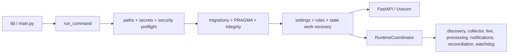
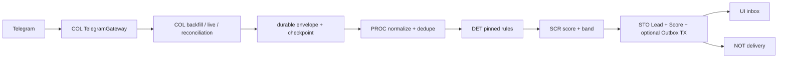

# Карта репозитория для LLM-агентов

| Поле | Значение |
|---|---|
| Назначение | Навигация: задача → владелец → требования → код → проверки |
| Статус | Справочный документ, не источник product requirements |
| Последняя сверка с деревом | 06.08.2026 |

Эта карта помогает быстро найти нужную область репозитория. Она не заменяет
[master PRD](../prd/README.md), [Decision Log](../prd/DECISION_LOG.md), shared contracts,
модульные PRD или [Traceability](../prd/TRACEABILITY.md). При расхождении действует
иерархия источников истины из корневого [AGENTS.md](../../AGENTS.md).

## 1. Как пользоваться картой

1. Прочитать корневой [AGENTS.md](../../AGENTS.md) и зафиксировать явный scope задачи.
2. По таблице модулей ниже определить единственного владельца изменяемого поведения.
3. Прочитать master PRD, `DECISION_LOG.md`, relevant shared contracts, `AGENTS.md` и
   `PRD.md` модуля-владельца, затем PRD его непосредственных соседей.
4. Перейти к указанным точкам входа реализации и проверить фактических consumers.
5. Выбрать проверки по таблице тестовых слоёв. Не считать наличие теста доказательством
   результата: учитывается только фактически выполненная проверка.
6. Перед завершением сверить `docs/prd/TRACEABILITY.md` и итоговый diff.

Для read-only анализа шаги изменения и запуска проверок не выполняются. Product code,
планы и внешние действия требуют прямой команды владельца.

## 2. Источники истины

### Product

Порядок чтения и precedence задаёт [AGENTS.md](../../AGENTS.md):

1. [Master PRD](../prd/README.md) — hard invariants, scope, стек и архитектура.
2. [Decision Log](../prd/DECISION_LOG.md) — принятые решения `D-*`.
3. [Domain Model](../prd/shared/DOMAIN_MODEL.md) и
   [Integration Contracts](../prd/shared/INTEGRATION_CONTRACTS.md) — ownership сущностей,
   DTO, ports и межмодульные границы.
4. Модульный PRD владельца поведения.
5. PRD непосредственных consumers.
6. [Shared Quality Requirements](../prd/shared/QUALITY_REQUIREMENTS.md) и
   [Traceability](../prd/TRACEABILITY.md) — проверяемые gates и покрытие.

### Engineering governance

[Engineering governance](README.md) регулирует процесс LLM-assisted changes отдельно от
product PRD. Его owner contract — [LLM Assurance Model](LLM_ASSURANCE_MODEL.md).
Governance не разрешает product code, Git/hosting или user-level configuration и не
добавляется в product `TRACEABILITY.md`.

## 3. Слои репозитория

| Путь | Назначение | Статус для агента |
|---|---|---|
| [AGENTS.md](../../AGENTS.md) | Корневой маршрутизатор и обязательный порядок чтения | Начальная точка |
| [docs/prd](../prd) | Нормативные product requirements, решения и contracts | Product source of truth |
| [src/telegram_lead_discovery](../../src/telegram_lead_discovery) | Фактическая Python-реализация продукта | Product runtime |
| [tests](../../tests) | Unit, contract, adapter, integration, quality и fixtures | Проверки по слоям |
| [deploy/windows](../../deploy/windows) | Регистрация Windows Task Scheduler tasks | INF deployment boundary |
| [tools](../../tools) | Product QA/calibration utilities и governance validators | Запускать только по scope |
| [docs/engineering](.) | LLM assurance, evidence и recovery contracts | Не product PRD |
| [schemas/quality](../../schemas/quality) | Машиночитаемые governance schemas | Governance source |
| [.cursor/rules](../../.cursor/rules) | Path-specific правила Cursor | Применять по затронутым paths |
| [.cursor/hooks](../../.cursor/hooks) | Project compliance hooks и policy manifest | Не менять без явного scope |
| [.cursor/agents](../../.cursor/agents) | Локальные определения ролей агентов | Tooling, не product architecture |
| [.cursor/skills](../../.cursor/skills) | Локальные workflow templates | Tooling; quarantined skills не использовать |
| [.omc/plans](../../.omc/plans) | Утверждённые исторические implementation plans | Контекст, не текущий source of truth |
| [.omc/artifacts](../../.omc/artifacts) | Исторические reports и evidence прошлых waves | Не принимать `PASS` на веру |
| [pyproject.toml](../../pyproject.toml) | Python package, dependencies, CLI и test/lint config | Runtime configuration |
| [uv.lock](../../uv.lock) | Зафиксированный dependency graph | Не редактировать вручную |

Локальные `.venv`, `__pycache__`, `.pytest_cache`, `.ruff_cache`, `.omc/runtime`,
`.cursor/quality-*` и `.cursor/session-compliance.json` — generated/runtime state. Они не
являются архитектурой, требованиями или evidence успешности сами по себе.

## 4. Точки входа

| Задача | Начать с | Дальше смотреть |
|---|---|---|
| CLI-команда | [pyproject.toml](../../pyproject.toml), [main.py](../../src/telegram_lead_discovery/main.py) | `infrastructure.runtime.run_command` |
| Startup/shutdown | [infrastructure/runtime.py](../../src/telegram_lead_discovery/infrastructure/runtime.py) | Security preflight, migrations, recovery, web и named loops |
| Web-приложение | [dashboard/app.py](../../src/telegram_lead_discovery/dashboard/app.py), [dashboard/app_factory.py](../../src/telegram_lead_discovery/dashboard/app_factory.py) | `dashboard/routes`, `dashboard/discovery`, templates/static |
| Telegram API | [collector/ports.py](../../src/telegram_lead_discovery/collector/ports.py) | `collector/adapter/telethon_gateway.py`, `collector/fake.py` |
| Collection | [collector/service.py](../../src/telegram_lead_discovery/collector/service.py) | Backfill, live updates, reconciliation, checkpoints |
| Lead processing | [processing/pipeline.py](../../src/telegram_lead_discovery/processing/pipeline.py) | normalization → detection → scoring → persistence/outbox |
| Keyword/graph scouting | [source_discovery/worker.py](../../src/telegram_lead_discovery/source_discovery/worker.py) | profiles, search, evidence, opportunities, graph services |
| Rules | [detection/engine.py](../../src/telegram_lead_discovery/detection/engine.py) | catalog, loader, persistence, seed |
| Score | [scoring/engine.py](../../src/telegram_lead_discovery/scoring/engine.py) | calibration и processing consumer |
| Physical schema | [storage/models.py](../../src/telegram_lead_discovery/storage/models.py) | repositories/helpers и Alembic revisions |
| Migrations | [storage/alembic/versions](../../src/telegram_lead_discovery/storage/alembic/versions) | `storage/migrate.py`, STO/INF PRD |
| Notification delivery | [notifications/worker.py](../../src/telegram_lead_discovery/notifications/worker.py) | `storage/outbox.py`, settings и secrets |
| Health/logging/metrics | [observability](../../src/telegram_lead_discovery/observability) | runtime loops, dashboard health routes |

CLI `tld` поддерживает `start`, `run`, `migrate`, `integrity-check`, `backup`, `restore`
и `purge`. Каноническая регистрация entry point находится в `pyproject.toml`; список и
аргументы команд — в `main.py`.

## 5. Карта product-модулей

В колонке «Код» перечислены основные фактические каталоги, а не новый ownership contract.
Физическая persistence общих сущностей находится в `storage`, но semantic owner остаётся
за модулем из Domain Model.

| Prefix | Владелец и документы | Основной код | Основные проверки | Непосредственные связи |
|---|---|---|---|---|
| `SRC` | [AGENTS](../prd/modules/01-source-discovery/AGENTS.md) · [PRD](../prd/modules/01-source-discovery/PRD.md) | [source_discovery](../../src/telegram_lead_discovery/source_discovery), UI adapter [dashboard/discovery](../../src/telegram_lead_discovery/dashboard/discovery) | [unit](../../tests/unit), [integration](../../tests/integration): keyword, graph, suppress, opportunity, promotion | Получает gateway/detect/storage/settings/security; публикует в COL/UI/OBS |
| `COL` | [AGENTS](../prd/modules/02-telegram-collector/AGENTS.md) · [PRD](../prd/modules/02-telegram-collector/PRD.md) | [collector](../../src/telegram_lead_discovery/collector) | [adapter](../../tests/adapter), [contract](../../tests/contract), integration collector/runtime | SRC/STO/SEC/INF → PROC/OBS |
| `PROC` | [AGENTS](../prd/modules/03-message-processing/AGENTS.md) · [PRD](../prd/modules/03-message-processing/PRD.md) | [processing](../../src/telegram_lead_discovery/processing) | unit normalization; integration pipeline/replay/runtime | COL/STO → DET/SCR/UI/OBS |
| `DET` | [AGENTS](../prd/modules/04-lead-detection/AGENTS.md) · [PRD](../prd/modules/04-lead-detection/PRD.md) | [detection](../../src/telegram_lead_discovery/detection) | unit detection/scoring; calibration fixtures | PROC/STO/SET → SCR/UI/OBS; pure detect также потребляет SRC |
| `SCR` | [AGENTS](../prd/modules/05-lead-scoring/AGENTS.md) · [PRD](../prd/modules/05-lead-scoring/PRD.md) | [scoring](../../src/telegram_lead_discovery/scoring) | unit detection/scoring; integration pipeline | PROC/DET/SRC → STO/UI/NOT/OBS |
| `STO` | [AGENTS](../prd/modules/06-lead-storage/AGENTS.md) · [PRD](../prd/modules/06-lead-storage/PRD.md) | [storage](../../src/telegram_lead_discovery/storage) | integration migrations, pragmas, transactions, outbox, retention, backup | Persistence boundary для всех modules |
| `UI` | [AGENTS](../prd/modules/07-lead-dashboard/AGENTS.md) · [PRD](../prd/modules/07-lead-dashboard/PRD.md) | [dashboard](../../src/telegram_lead_discovery/dashboard) | integration dashboard/UI/routes/CSRF/export | Adapter consumer SRC/COL/DET/SCR/STO/SET/OBS |
| `NOT` | [AGENTS](../prd/modules/08-notifications/AGENTS.md) · [PRD](../prd/modules/08-notifications/PRD.md) | [notifications](../../src/telegram_lead_discovery/notifications), [storage/outbox.py](../../src/telegram_lead_discovery/storage/outbox.py) | integration notifications/outbox/shadow | SCR/STO/SET/OBS/SEC → UI/OBS |
| `SET` | [AGENTS](../prd/modules/09-operator-settings/AGENTS.md) · [PRD](../prd/modules/09-operator-settings/PRD.md) | [settings](../../src/telegram_lead_discovery/settings) | integration storage settings; unit security settings | STO/SEC/INF → почти все runtime consumers |
| `OBS` | [AGENTS](../prd/modules/10-administration-observability/AGENTS.md) · [PRD](../prd/modules/10-administration-observability/PRD.md) | [observability](../../src/telegram_lead_discovery/observability) | unit/integration observability, runtime и capacity | Наблюдает runtime modules → UI/NOT |
| `SEC` | [AGENTS](../prd/modules/11-security/AGENTS.md) · [PRD](../prd/modules/11-security/PRD.md) | [security](../../src/telegram_lead_discovery/security) | unit security; integration shadow/UI/backup boundaries | INF → все modules |
| `INF` | [AGENTS](../prd/modules/12-deployment-infrastructure/AGENTS.md) · [PRD](../prd/modules/12-deployment-infrastructure/PRD.md) | [infrastructure](../../src/telegram_lead_discovery/infrastructure), [main.py](../../src/telegram_lead_discovery/main.py), [deploy/windows](../../deploy/windows) | unit infrastructure; integration runtime/backup/recovery/capacity | SEC/STO/SET/OBS и все runtime loops |

## 6. Основные потоки

### Startup и runtime



`RuntimeCoordinator` владеет shared `TelegramGateway` и named asyncio loops. Приложение
работает одним process; Redis, Celery и отдельные workers отсутствуют.

### Monitoring message → Lead



Checkpoint обновляет COL вместе с durable envelope. `PersistProcessingResult` не владеет
checkpoint. Hot outbox создаётся только при `delivery_mode=live` и наличии notification
secrets; shadow mode сохраняет Lead без hot outbox.

### Keyword scouting → ручной candidate

```mermaid
flowchart LR
    UI["UI manual start"] --> JOB["SRC keyword job"]
    JOB --> GW["COL search ports / Zero Stars"]
    GW --> PURE["DET pure pinned evaluation"]
    PURE --> EVID["SRC evidence + opportunity"]
    EVID --> REVIEW["operator review"]
    REVIEW --> PROMOTE["manual promotion"]
    PROMOTE --> CAND["TelegramSource candidate"]
    CAND --> APPROVE["separate approve"]
    APPROVE --> COL["COL monitoring pipeline"]
```



Scouting evidence не создаёт `TelegramEventEnvelope`, `TelegramMessage`, Lead, LeadScore,
notification outbox и не меняет `CollectorCheckpoint`.

## 7. Критические архитектурные границы

- Telethon imports допустимы только внутри `collector/adapter`.
- Telegram I/O использует `TelegramPeerRef`; DB `source_id` не является Telethon entity.
- `storage/models.py` определяет физические tables, но не переносит semantic ownership в STO.
- HTTP/UI является adapter boundary и не должен изобретать validation owning modules.
- Processing использует pinned `rule_set_version_id` и checksum; seed catalog не является
  runtime fallback.
- Source Opportunity Score принадлежит SRC, а Lead Score — SCR.
- Scouting pipeline изолирован от monitoring/lead pipeline до ручного promotion и approve.
- Lead, Score и eligible outbox сохраняются одной transaction; Bot API вызывается позже.
- Runtime остаётся single-process и loopback-only.
- Product runtime не содержит AI/LLM, embeddings или semantic/vector search.

Нормативные формулировки этих границ находятся в master/shared/module PRD, а не здесь.

## 8. Тестовые слои

| Слой | Путь | Когда выбирать |
|---|---|---|
| Unit | [tests/unit](../../tests/unit) | Pure rules, normalization, scoring, state/algorithm behavior |
| Contract | [tests/contract](../../tests/contract) | DTO/import/route compatibility и fake gateway contract |
| Adapter | [tests/adapter](../../tests/adapter) | Telethon mapping, peer history, Zero Stars boundary |
| Integration | [tests/integration](../../tests/integration) | SQLite, migrations, transactions, runtime, UI, outbox, recovery |
| Calibration fixtures | [tests/fixtures/calibration](../../tests/fixtures/calibration) | Versioned DET/discovery quality corpora |
| Capacity harness | [tests/harness](../../tests/harness) | Performance/recovery gates |
| Governance | [tests/quality](../../tests/quality) | Hooks, policy engine, journal, evidence и validators |
| Governance fixtures | [tests/fixtures/quality](../../tests/fixtures/quality) | Capability/policy/journal scenarios |

Базовые команды определяются фактическим toolchain репозитория:

```powershell
uv run pytest
uv run pytest tests/unit
uv run pytest tests/contract tests/adapter
uv run pytest tests/integration
uv run ruff check src tests
node tools/quality/run-quality-suite.mjs
```

Запуск команды разрешён только scope текущей задачи. Незапущенная проверка имеет статус
`not run`, а не `pass`.

## 9. Быстрые маршруты изменений

| Изменение | Владелец и обязательное чтение | Код | Проверки |
|---|---|---|---|
| Telegram method/DTO/error | COL PRD + Integration Contracts; SRC PRD для search consumer | `collector/ports.py`, adapter, fake, collector/SRC consumer | contract + adapter + relevant integration |
| Source scouting/ranking/suppress | SRC PRD + DET/COL/STO/UI consumers | `source_discovery`, `dashboard/discovery`, physical storage/migration при schema delta | unit + keyword/graph/suppress integration + calibration when rules affected |
| Message/replay/dedupe | PROC PRD + COL/DET/SCR/STO | `processing`, collector envelope producer, storage | unit normalization + pipeline/replay integration |
| Detection rule | DET PRD appendix + SCR/SRC consumers | `detection` catalog/loader/engine/persistence | unit + golden/calibration + pipeline integration |
| Score/band | SCR PRD + DET/STO/UI/NOT | `scoring`, persistence/outbox consumers | unit + pipeline/outbox/UI integration |
| Schema/table/index | STO PRD + semantic owner PRD + INF when recovery affected | models + new Alembic revision + repositories | migration + integrity + affected integration |
| Dashboard route/template | UI PRD + owning command/query module | `dashboard/routes` или `dashboard/discovery`, templates/static | UI/routes/CSRF/export integration |
| Startup/loop/recovery | INF PRD + COL/PROC/NOT/OBS/STO | `infrastructure/runtime.py`, owning loop service | runtime/recovery/backup/capacity integration |
| Governance/hook/schema | LLM Assurance Model + Change Evidence | `.cursor/hooks`, `schemas/quality`, `tools/quality` | `tests/quality` + independent claim verification |

## 10. Файлы повышенного риска

Следующие файлы концентрируют несколько orchestration responsibilities и требуют чтения
consumers до локальной правки:

- `source_discovery/worker.py` — keyword и graph workers, network/transaction boundaries,
  suppress, verification и funnel counters;
- `infrastructure/runtime.py` — startup order, recovery и все named loops;
- `storage/models.py` — общая физическая schema разных semantic owners;
- `processing/pipeline.py` — atomic end-to-end lead processing;
- `collector/adapter/telethon_gateway.py` — единственная разрешённая Telethon boundary;
- `dashboard/discovery/*` — UI adapter нескольких SRC commands и read models.

Их текущий размер или сложность не являются разрешением копировать подход. Изменение должно
оставаться минимальным, не создавать новый ownership и не смешивать network I/O с длинной
SQLite write transaction.

## 11. Что не считать доказательством

- Исторический `verification-report.md`, `PASS` или API response без повторной фактической
  проверки в текущем scope.
- Зелёный unit test как доказательство Windows deployment, live Telegram behavior,
  calibration quality или полного пользовательского результата.
- Отсутствие exception как доказательство сохранённого состояния или доставленного события.
- Generated cache, journal, claim или session state без независимой верификации.
- Количество файлов, тестов, агентов или вызовов инструментов как критерий готовности.

## 12. Поддержка карты

Карту обновляют вместе с изменением, если меняется хотя бы одно из следующего:

- root-level каталог или назначение существующего слоя;
- CLI/application entry point;
- ownership модуля, shared port, producer/consumer или основной pipeline;
- расположение package, migration, route или test layer;
- governance owner document или validator entry point.

Карта остаётся навигационной: product requirements, enums, thresholds и acceptance scenarios
не дублируются. Для проверки изменения карты используются:

```powershell
node tools/quality/validate-governance.mjs
python tools/quality/validate-prd.py
git diff --check
git diff --name-only
```

Готовность карты подтверждается, если из корневого `AGENTS.md` агент за один переход находит
эту карту, а из неё максимум за два перехода — владельца, нормативные документы, реализацию
и релевантный тестовый слой для Telegram API, scouting, pipeline, migration, UI, runtime и
governance-задач.
