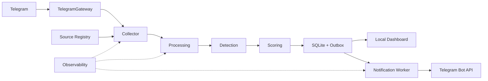
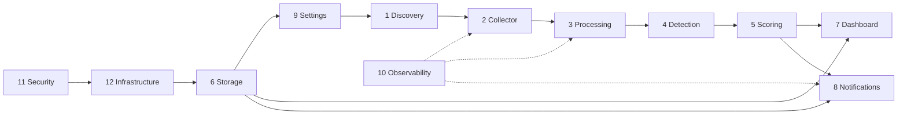

# Product Requirements Document

## Telegram Lead Discovery MVP

| Поле | Значение |
|---|---|
| Версия | 1.0 |
| Статус | Decision-complete technical baseline |
| Дата | 15.07.2026 |
| Пользователь | Один локальный оператор |
| Язык | RU-first |
| Реализация | Не начата |

## 1. Назначение продукта

Telegram Lead Discovery — персональное локальное приложение, которое получает сообщения только из публичных и вручную одобренных Telegram-источников, детерминированно выделяет коммерческие запросы на разработку и собирает их в едином inbox.

Продукт сокращает ручной просмотр чатов и каналов, показывает причины классификации и сохраняет ссылку на исходное сообщение. Он не связывается с автором автоматически и не принимает коммерческие решения за оператора.

## 2. Goals

- Собирать новые сообщения из одобренных источников через live updates.
- Восстанавливать пропуски через bounded backfill и reconciliation.
- Выделять лиды rule-based правилами без AI/LLM.
- Присваивать категорию, score `0–100`, band и объяснение.
- Исключать вакансии, рекламу, spam и нерелевантные сообщения.
- Обрабатывать повторную доставку, edits, deletes и exact reposts идемпотентно.
- Давать оператору локальный RU-интерфейс для triage и управления источниками/правилами.
- Отправлять минимальные Telegram-уведомления только для `hot` leads и критических сбоев.
- Переживать restart без потери committed данных и без повторных уведомлений.

## 3. Non-goals

- Multi-user, RBAC, организации и удалённый SaaS-доступ.
- Private-source auto-join и invite automation.
- Account rotation или переключение аккаунта после FloodWait.
- AI/LLM, embeddings и semantic/vector search.
- Fuzzy deduplication.
- Automatic outreach, ответы авторам и CRM-автоматизация.
- Общий бесконечный каталог Telegram и платный global post search.
- Mobile application и отдельный SPA frontend.
- PostgreSQL, Redis, Celery и распределённые workers.

## 4. Persona

Единственный оператор — веб-разработчик, который ищет заказы на сайты, Telegram-ботов, интеграции/API, автоматизацию/парсеры и e-commerce решения.

Оператору нужны:

- быстрый список свежих лидов;
- понятные причины score;
- ручное управление источниками;
- простая корректировка versioned rules;
- отсутствие сложной инфраструктуры;
- возможность реализовывать систему по модульным PRD с AI-агентами.

## 5. Основные journeys

### J-01. Добавление источника

1. Оператор вводит public username/URL или импортирует seed-список.
2. Система создаёт `SourceCandidate` и собирает доступные метаданные.
3. Оператор выполняет `approve` или `reject` с заметкой.
4. После `approve` техническая проверка переводит источник в `monitoring`.
5. Создаётся bounded backfill job.

### J-02. Discovery

1. Оператор запускает discovery run от выбранных approved sources.
2. Система обходит рекомендации, публичные ссылки, упоминания и forward origins.
3. Run ограничен depth `2`, `25` раскрываемыми источниками и `100` кандидатами.
4. Результаты появляются как candidates и не включаются автоматически.

### J-03. Обнаружение лида

1. Collector получает live update либо reconciliation result.
2. Processing выполняет claim, normalization и dedupe.
3. Detection применяет hard exclusions и positive rules активной версии.
4. Scoring рассчитывает components, total и band.
5. Storage сохраняет message, result, lead и outbox атомарно.
6. `hot` lead появляется в inbox и отправляется оператору через Bot API.

### J-04. Ежедневный triage

1. Оператор открывает inbox, отсортированный по freshness.
2. Фильтрует по band, category, source, profile и status.
3. Изучает rule IDs и score breakdown.
4. Переходит к исходному сообщению, если permalink существует.
5. Меняет lead status и при необходимости оставляет feedback.

### J-05. Edit, delete и replay

1. Edit создаёт новую revision и новый processing result.
2. Delete помечает message и lead, сохраняя последний известный текст до scheduled purge.
3. Повторно доставленный update возвращает существующий результат.
4. Exact repost связывается с canonical message и не создаёт второе уведомление.

### J-06. Изменение правил

1. Оператор создаёт draft из активного `RuleSetVersion`.
2. Система компилирует patterns, выполняет timeout tests и прогоняет calibration corpus.
3. Успешный draft активируется как новая immutable version.
4. Re-score создаёт новые score records, не перезаписывая предыдущие.

### J-07. Восстановление

1. После старта приложение получает exclusive ownership Telethon session.
2. Выполняет migrations и `PRAGMA integrity_check`.
3. Возобновляет durable jobs и outbox deliveries.
4. Reconciliation продолжает чтение от committed checkpoints.

## 6. Зафиксированный стек

| Область | Решение |
|---|---|
| Runtime | Python 3.12.x, один process, `asyncio` services |
| Telegram collection | Telethon 1.44.x только за `TelegramGateway` |
| Web | FastAPI, Uvicorn, Jinja2, HTMX, обычный CSS |
| Persistence | SQLite, SQLAlchemy 2.x, Alembic, aiosqlite |
| Regex | `regex`, timeout `50 ms`, input cap `4096` characters |
| Notifications | Telegram Bot API через `httpx` |
| Dependencies | `uv`, `pyproject.toml`, lock-файл |
| Platform | Windows 10/11 x64, Windows Task Scheduler |
| Background work | persisted jobs и внутренние async workers |

## 7. Высокоуровневая архитектура



Один process запускает web server, Telethon owner, collector, processing workers, outbox worker и maintenance scheduler. Сервисы разделены typed contracts и не импортируют Telethon types за пределами gateway.

## 8. Сквозные инварианты

- Source Registry в SQLite — единственный authoritative источник monitored sources.
- Collector вызывает Telegram только для `monitoring` sources.
- Только один process владеет user session.
- `UNIQUE(source_id, telegram_message_id)` обеспечивает Telegram identity.
- Checkpoint обновляется после commit message data.
- Один active `RuleSetVersion`; активированная версия immutable.
- Один canonical lead на canonical message.
- Lead и notification outbox создаются одной транзакцией.
- Outbox delivery имеет уникальный idempotency key.
- Все timestamps сохраняются в UTC; UI показывает `Europe/Moscow`.
- Секреты, session и bot token не попадают в product database, logs, exports или backups.

## 9. Жизненный цикл лида

```text
new → reviewed → contacted → won
                   └──────→ lost
new/reviewed → ignored
new/reviewed/contacted → source_deleted
```

- `hot`, `warm` и `cold` создают Lead.
- `irrelevant` сохраняется как processing outcome и не попадает в inbox.
- Возврат из terminal state выполняется отдельным ручным действием с заметкой.
- Status history append-only.
- Automatic outreach отсутствует.

## 10. Score bands

| Score | Band | Поведение |
|---:|---|---|
| 70–100 | `hot` | Inbox и немедленное уведомление |
| 50–69 | `warm` | Inbox |
| 30–49 | `cold` | Inbox |
| 0–29 | `irrelevant` | Только processing outcome |

`vacancy`, `advertising` и `spam` являются hard exclusions и принудительно дают `irrelevant`.

## 11. Модули

| № | Модуль | Prefix | Владеет |
|---:|---|---|---|
| 1 | [Source Discovery](modules/01-source-discovery/PRD.md) | `SRC` | candidates, discovery, source lifecycle |
| 2 | [Telegram Collector](modules/02-telegram-collector/PRD.md) | `COL` | gateway, backfill, live, reconciliation |
| 3 | [Message Processing](modules/03-message-processing/PRD.md) | `PROC` | normalization, orchestration, dedupe behavior |
| 4 | [Lead Detection](modules/04-lead-detection/PRD.md) | `DET` | rules, categories, patterns, explanation |
| 5 | [Lead Scoring](modules/05-lead-scoring/PRD.md) | `SCR` | components, total, bands, calibration |
| 6 | [Lead Storage](modules/06-lead-storage/PRD.md) | `STO` | schema, migrations, revisions, outbox, purge |
| 7 | [Lead Dashboard](modules/07-lead-dashboard/PRD.md) | `UI` | inbox, triage, local web UI, export |
| 8 | [Notifications](modules/08-notifications/PRD.md) | `NOT` | Bot API delivery, retries, idempotency |
| 9 | [Operator Settings](modules/09-operator-settings/PRD.md) | `SET` | settings, local access, validation |
| 10 | [Administration and Observability](modules/10-administration-observability/PRD.md) | `OBS` | health, metrics, logs, job controls |
| 11 | [Security](modules/11-security/PRD.md) | `SEC` | session, secrets, ACL, redaction |
| 12 | [Deployment and Infrastructure](modules/12-deployment-infrastructure/PRD.md) | `INF` | runtime, startup, backup/restore, Windows |

## 12. Dependency order



## 13. Хранение

| Класс | Срок |
|---|---:|
| Leads, lead messages, scores, revisions, status history | 180 дней после последней активности |
| Полный текст non-lead messages | 30 дней |
| Non-lead hash и processing outcome | 90 дней |
| Processing logs | 30 дней |
| Metrics | 90 дней |
| Notification deliveries | 30 дней |
| Temporary CSV | 1 час |

Scheduled purge запускается ежедневно в `04:00`. Daily online backup запускается в `03:00`; сохраняются `7` daily и `4` weekly copies.

## 14. Success metrics

- Calibration corpus: минимум `500` сообщений из минимум `10` sources.
- Precision `hot + warm`: не ниже `80%`.
- Recall `direct_order`: не ниже `70%`.
- False positive rate для negative categories: не выше `5%`.
- p95 live update → committed Lead: не более `10 секунд`.
- p95 committed Lead → notification: не более `30 секунд`.
- Recovery live gap: не более `20 минут`.
- Duplicate Lead и notification в replay suite: `0`.
- Restart recovery: не более `5 минут`.
- Migration, backup restore и SQLite integrity suites проходят без ошибок.

## 15. Rollout

1. **Documentation baseline:** утверждены master, shared contracts, 12 modules и traceability.
2. **Foundation:** runtime, security, migrations, storage и settings.
3. **Ingestion sandbox:** ручные sources, backfill, live updates и reconciliation без notifications.
4. **Offline calibration:** corpus `500/10`, fixed rule set и quality gates.
5. **Shadow mode:** leads видны только в dashboard; проверяются latency, duplicates и recovery.
6. **Notification pilot:** включаются только `hot` lead alerts.
7. **MVP release:** autostart, backup, purge, alerts и acceptance suite включены.

Rollback отключает новые collector jobs и notification delivery, сохраняет committed checkpoints и позволяет read-only доступ к dashboard.

## 16. Definition of Done

- Все 12 модульных PRD выполнены и связаны с shared contracts.
- Каждое MVP-требование имеет acceptance criterion и acceptance test.
- Runtime не содержит AI/LLM, private auto-join, account rotation или automatic outreach.
- Replay, edit, delete, reconciliation и outbox recovery проходят детерминированно.
- Rule set воспроизводит category, score и explanation по сохранённой версии.
- Security scan не находит secrets/session в database, logs, exports или backups.
- Success metrics раздела 14 достигнуты.

## 17. Сопутствующие документы

- [Decision Log](DECISION_LOG.md)
- [Traceability](TRACEABILITY.md)
- [Domain Model](shared/DOMAIN_MODEL.md)
- [Integration Contracts](shared/INTEGRATION_CONTRACTS.md)
- [Quality Requirements](shared/QUALITY_REQUIREMENTS.md)
